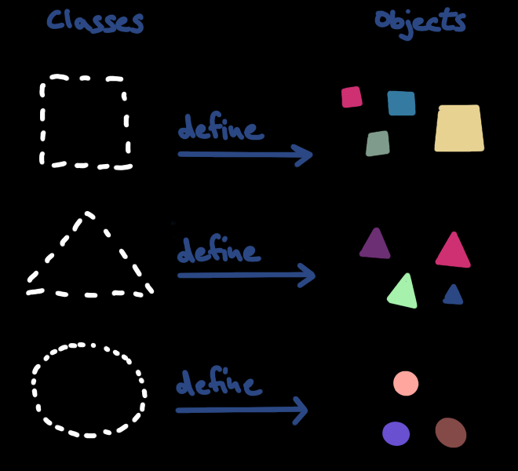
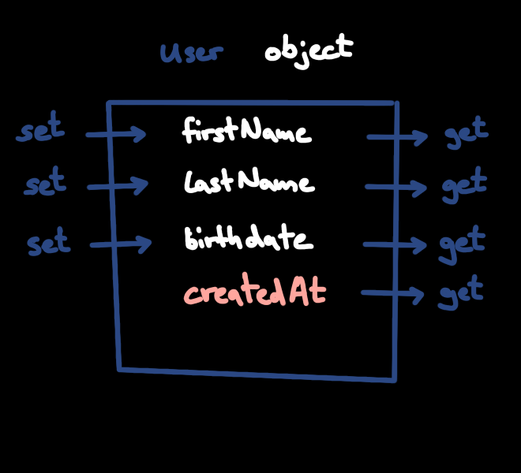

Object-oriented Programming (OOP) is still one of the most dominant programming
methodologies, altough this changed a lot compared to with two decades ago when
it was seen as the silver bullet to creating software. Java bought heavily into
OOP from early on in the 90s and managed to rejuvenate in the recent years.

# Classes and Objects

An _Object_ is said to be _instantiated_ after a _Class_ which serves as a
blueprint and can both be defined by the programmer as well as be taken from the
[Java Standard Library](https://docs.oracle.com/en/java/javase/20/docs/api/index.html)
or a third-party library.

Instantiating an object after a given class `MyClass` is simply done by calling
`new MyClass()` and assigning it to a reference variable which points to the
data behind the newly created object in the computer's memory.

While the instantiated objects serve as container for concrete data and related
functionalities (methods), the class serves as an abstraction which lets the
programmer define the relations between classes and thus the objects they served
as a blueprint for.

# The Concept of an Object

As said, Objects are like containers of data and their logically associated
functionalities (methods). This means that methods defined in a Class can be
used by every instance of that class. The data of every object, however, is
unique to every instance.

## Encapsulation

One of the core principles of OOP is _encapsulation_ which means that the data
of an object is only accessible through specialized methods, so called _getters_
and _setters_, combined called _accessors_. Even though those _getters_ and
_setters_ don't do anything, it is still common to define them in order to be
able to change the implementation "under the hood" without having to change the
code that uses the object.

In practice this is only of theoretical value (on objects) and leads to a lot of
boilerplate code: For each data field you will need to define both a _getter_-
and _setter_ method which don't do anything but return or set the according data
field. There is [project Lombok](https://projectlombok.org/) which helps with
generating accessor methods automatically as part of the compilation or use code
generation facilitation ("create getters and setters") of an IDE of your choice
(for Java I recommend
[IntelliJ IDEA Community Edition](https://www.jetbrains.com/idea/) which is
proprietary but free to use).

The problem with the approach of accessor methods is that it hints at a wrong
approach for encapsulation. It is _not_ good if you encapsulate the fact that
the object is doing a network operation unless you make that clear by giving its
according class an appropriate name. You would also rather not add name
correcting code into accessor methods if you rename your classes fields from
`firstName` to `givenName` because once your code is aging, you will pile up a
lot of those correcting code and everything will end up in a mess. You can do
that _temporarily_ though in order to quickly change your code without having to
change the underlying database schema. Code rot is a real thing.

> ### Encapsulation in systems design
>
> The idea of encapsulating technical implementation and exposing only certain
> methods to the public though is a principle that is _very_ valuable, because
> it allows designing software that can be reused without having the user to
> understand each and every technical detail.
>
> A real world comparison would be a car driver who does not need to know each
> and every detail of the car's engine in order to drive it. In programming, it
> helps the creator of a software to express the intent of the code design
> making it easier to reuse by others and understand its behavior.

# Polymorphism

.....todo write paragraph about polymorphism

# Recap

We learned that

- Classes can be user-defined or taken from an existing library
- Objects are instantiated after a Class definition by the `new` keyword
- Encapsulation is a core principle of OOP though to be taken with a grain of
  salt
- Encapsulation is an important principle in systems design
- Polymorphism allows you to define multiple methods of a same name with
  different parameters

Now that we know about the relationship between Objects and their Class, the
next step is to dive into the relationship types between Classes themselves.
This is where OOP still shines: In order to expressively model complex Domains.

[Part 2: Relationships between Classes](/blog/2023/04/oop-in-java-pt2-relationships-between-classes/)
