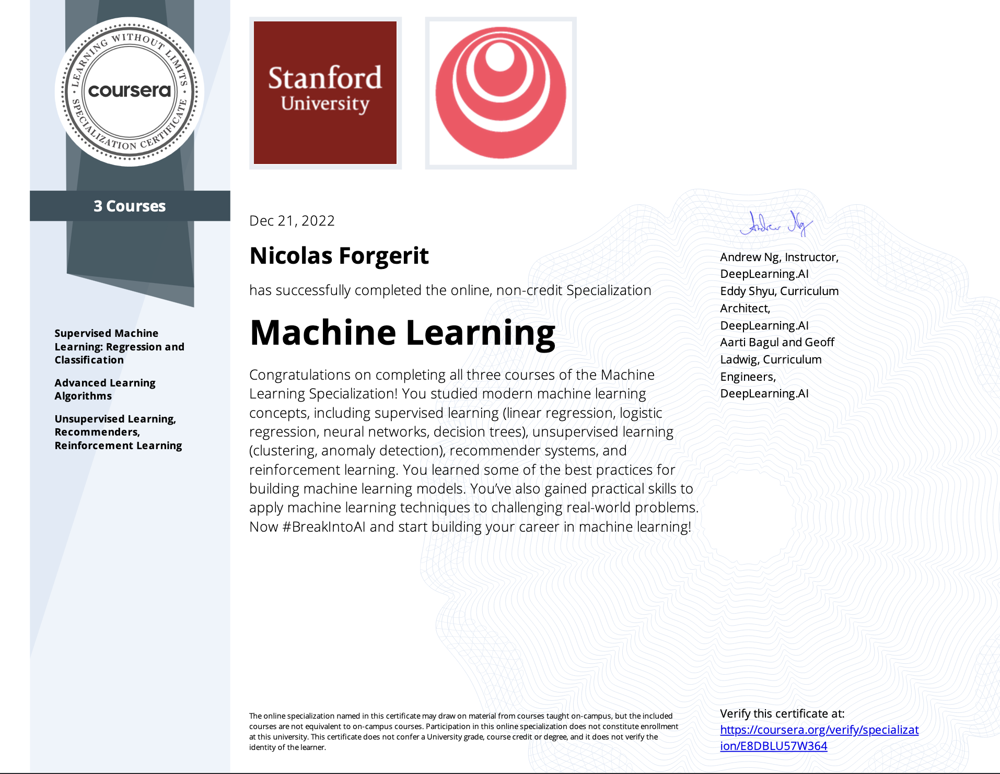

# Course 1

Supervised Machine Learning: Regression and Classification

## Week 1: Introduction to ML

- Supervised Learning
- Unsupervised Learning
- Jupyter Notebooks
- Linear Regression Model
- Cost function and Visualization
- Gradient Descent
- Learning Rate

## Week 2: Regression with multiple input variables

- Multiple features
- Vectorization
- Gradient descent for multiple linear regression
- Feature scaling
- Gradient descent convergence
- Feature Engineering
- Polynomial regression

## Week 3: Classification

- Logistic Regression
- Decision boundary
- Cost function for logistic regression
- Gradient descent implementation
- Overfitting
- Regularized linear and logistic regression

# Course 2

Advanced Learning Algorithms

## Week 1: Neural Networks

- Neurons and the brain
- Neural network layer
- Inference, making predictions using forward propagation
- TensorFlow
- Matrix Multiplication

## Week 2: Neural network training

- TensorFlow implementation
- Alternatives to sigmoid activation function
- Choosing activation functions
- Multiclass
- Softmax
- Neural networks with Softmax output
- Improved Softmax implementation
- Classification with multiple outputs
- Advanced optimization
- Additional Layer Types
- What is a derivative?
- Computation graph
- Larger neural networks example

## Week 3: Advice for applying machine learning

- Deciding what to try next
- Evaluating a model
- Model selection and training/cross validation/test sets
- Diagnosing bias and variance
- Regularization bias/variance
- Establishing a baseline level of performance
- Learning curves
- Deciding what to try next revisited
- Bias/variance and neural networks
- Iterative loop of ML development
- Error analysis
- Addind data
- Transfer learning: using data from a different task
- Full cycle of an ML project
- Fairness, bias and ethics
- Error metrics for skewed datasets
- Trading off precision and recall

## Week 4: Decision trees

- Decision tree model
- Learning process
- Measuring purity
- Choosing a split: Information gain
- Putting it together
- Using one-hot encoding of categorical features
- Continuous valued features
- Regression trees
- Using multiple decision trees
- Sampling with replacement
- Random forest algorithm
- XGBoost
- When to use decision trees

# Course 3

Unsupervised Learning, Recommenders, Reinforcement Learning

## Week 1: Unsupervised learning

- What is clustering
- K-means intuition
- K-means algorithm
- Optimization objective
- Initializing K-means
- Choosing the number of clusters
- Finding unusual events
- Gaussian (normal) distribution
- Anomaly detection algorithm
- Developing and evaluating an anomaly detection system
- Anomaly detection vs. supervised learning
- Choosing what features to use

## Week 2: Recommender systems

- Making recommendations
- Using per-item features
- Collaborative filtering algorithm
- Binary labels: favs, likes and clicks
- Mean normalization
- TensorFlow implementation of collaborative filtering
- Finding related items
- Collaborative filtering vs Content-based filtering
- Deep learning for content-based filtering
- Recommending from a large catalogue
- Ethical use of recommender systems
- TensorFlow implementation of content-based filtering
- Reducing the number of features (optional)
- PCA algorithm
- PCA in code

## Week 3: Reinforcement learning

- The Return of reinforcement learning
- Making decisions: Policies in reinforcement learning
- Review of key concepts
- State-action value function example
- Bellman equation
- Random (stochastic) environment
- Example of continuous state space applications
- Lunar lander
- Learnign the state-value function
- Algorithm refinement: $\epsilon$-greedy policy
- Algorithm refinement: Mini-batch and soft updates
- The state of reinforcement learning
